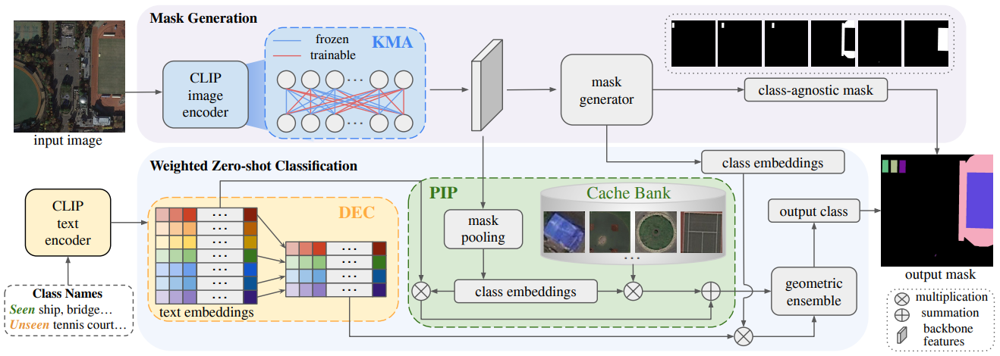

<h2 align="center">ZoRI: Towards Discriminative Zero-Shot Remote Sensing Instance Segmentation</h2>
<p> <a href="https://arxiv.org/abs/2412.12798"></a>
<a href="https://arxiv.org/pdf/2412.12798v1"></a>


This repository contains code for our **AAAI2025** paper: [ZoRI: Towards Discriminative Zero-Shot Remote Sensing Instance Segmentation](https://arxiv.org/abs/2412.12798).

<div align="center">
  
</div><br/>

## TODO List ✅
- [x] Modules implementation
- [x] Dataset release
- [x] Main code release


## Installation
Please see [Installation Instructions](INSTALL.md).

## Datasets
Download datasets for zero-shot remote sensing instance segmentation from [Hugging Face ](https://huggingface.co/datasets/HuangShiqi008/ZoRI).

## Getting Started
Please see [Getting Started with ZoRI](GETTING_STARTED.md).

## Training
```
python train_net.py --config-file configs/zori_isaid_11_4.yaml
```
## Inference
###
For GZSRI setting, run
```
python train_net.py  --config-file configs/zori_isaid_11_4.yaml --eval-only MODEL.WEIGHTS [path_to_weights]
```
###
For ZSRI setting, run
```
python train_net.py  --config-file configs/zori_isaid_11_4.yaml --eval-only MODEL.WEIGHTS [path_to_weights] DATASETS.TEST '("isaid_zsi_11_4_val_unseen",)' MODEL.GENERALIZED False MODEL.CACHE_BANK.ALPHA 0.6
```
###
Then get pseudo unseen visual prototypes from previous inference results, run
```
python -m zori.utils.cache_model_unseen --config configs/cache.yaml DATASET 'isaid_zsi_11_4_val' PROTOTYPE_NUM [1] RESULTS [path_to_json]
```
###
Finally, inference again with pseudo unseen visual prototypes to get final predictions.


## Acknowledgement
This project is based on [FC-CLIP](https://github.com/bytedance/fc-clip). Many thanks to the authors for their great work!

## BibTeX
Please consider to cite ZoRI if it helps your research.

```bibtex
@inproceedings{ZoRI,
title={ZoRI: Towards Discriminative Zero-Shot Remote Sensing Instance Segmentation},
author={Huang, Shiqi and He, Shuting and Wen, Bihan},
booktitle={Proceedings of the AAAI Conference on Artificial Intelligence},
year={2025}
}
```

